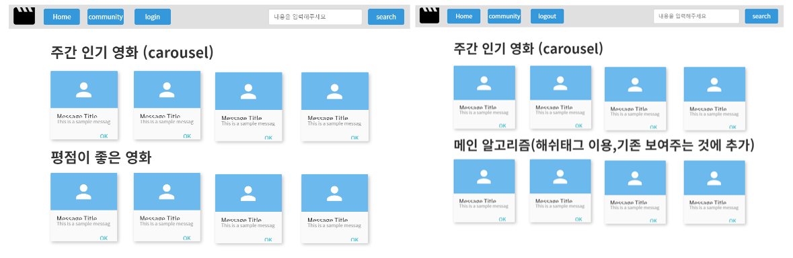

# :notebook:  프로젝트 소개

- 영화 정보 기반 추천 서비스 구성 :movie_camera:

- 사용 언어 

  - python 3.9
  - Django 3.2
  - Vue.js

- 아키텍처 : Django REST API 서버 & Vue.js

- 업무 분담 내역

  - 주지환 : Front-end 구성
  - 정지윤 : Back-end 구성

- 프로젝트 포함 fixture

  - accounts : admin-admin
  - community
  - movies

# :notebook:  프로젝트 실행순서

## 💥back 실행 순서

1. `python -m venv venv`

2. `ctrt+shift+p` 단축키 실행 => 가상환경 적용

3. `source/venv/Scripts/activate` 가상환경 실행

4. `pip install -r requirements.txt`

5. `python manage.py migrate`

   **<loaddata의 경우 아래의 account의 fixtures를 먼저 load한 후에 community의fixtures를 load 할것>**

6. `python manage.py loaddata movies.json`

7. `python manage.py loaddata accounts.json`

8. `python manage.py loaddata community.json`

9. `python manage.py runserver`

## 💥front 실행 순서

1. npm i
2. npm run serve

#  :facepunch: 프로젝트 목표

**`Hashtag`에 기반한 영화 추천 서비스** !

커뮤니티 페이지의 기능을 잘 활용하여 사용자들의 관심 정보들을  `Hashtag`로 분류하여 관련 영화 목록들을 추천하는 서비스를 구성하기로 하였다.

- 초기 화면 기획안 (ovenapp 사용)

  - `Home`

  

  - `Search` / `Detail`

    

  - `Login`/ `Signup`

    

  - `Community`

    

# :sweat_smile: 프로젝트수행 과정

- **URL 주소 관리** : google docs를 활용하여 URL 주소 공유

  

- **일정 관리** : 디스코드 및  Notion을 통해 일정 관리

  ​					 									

  

- **데이터베이스 모델링 (ERD)**

# :page_with_curl: 기능 및 화면 설명

## :house: HOME 화면 

- `Weekly Boxoffice`

  **영화진흥위원회**의 주간 박스 오피스 조회 API를 활용하여 오늘 날짜를 기준으로 한 주간 상영작들의 박스오피스 정보를 보여줍니다.

- `Top Rated Movies`

  평점이 높은 영화 10개를 추천해줍니다.

- `Hashtag` 영화 추천

  해당 서비스의 게시판 내 가장 개수가 많은 <u>Hashtag 1, 2위</u>에 대해 제목 및 줄거리에 관련이 있는 영화 10가지를 임의로 추천해줍니다.

​														

- `Hashtag` 배지 

  `Hashtag` 배지를 클릭하면 현재 인기 있는 `Hashtag`태그들에 대해 보여줍니다. 또한, 해당 `Hashtag` 클릭 시, `Hashtag` 1위에 관한 영화 내용이 해당 `Hashtag` 내용으로 변경되어 알려줍니다.  (`#어벤져스` 클릭 시 아래 그림과 같이 영화 내용 변경)

  

  

## :pencil: Detail 화면

`weekly Boxffice` 부분을 제외한 영화 포스터 이미지 클릭 시 영화에 대한 상세 정보를 볼 수 있습니다. 

 

## :mag_right:  Search 기능 및 화면

- 검색창 

  상단 navbar에 검색을 할 수 있는 검색창을 만들었습니다.

- 검색 결과

  검색어 입력 시 영화 정보의 제목, 줄거리, 배우(영어만 가능), 장르에 대한 검색 결과를  보여줍니다.

## :writing_hand:  Community 화면

서비스 유저들이 영화에 관해 자유롭게 의논할 수 있는 페이지 입니다.

- 전체 게시글 화면

  `v-expansion-panel` components를 사용하여 게시판 화면을 구성하였습니다. 영화 제목과 작성일자, 리뷰제목, 조회수가 출력되도록 하였으며, 해당 패널 선택 시 하단으로 해당 게시글의 디테일 내용이 조회됩니다.

  

​	

- 게시글 디테일 화면

  선택한 영화에 맞는 `Poster Image` 가 출력되며 작성된 게시글의 내용과 하단에는 `Comments`를 추가할 수 있는 기능이 있어 게시글에 대해 댓글을 작성할 수 있습니다. 

  

  

  

- 게시글 작성 화면

  전체 게시글 화면 상단의 <u>연필 아이콘</u> 클릭 시 글을 작성할 수 있는 창이 뜹니다.  영화 제목과 게시글 제목, 별점, 내용을 작성 후 저장을 누르면 게시글이 등록됩니다. 영화 선택 부분은 검색어에 맞게 필터링되어 결과를 보여줍니다. 

  

  

  

  

  >** Hashtag 수집 규칙
  >
  >- 게시글 작성 시 `Hashtag`를 입력하면 서버의 `Hashtag` 테이블에 등록됩니다.
  >-  하나의 글에 다량으로 동일한 Hashtag 작성하는 악성 사용자를 막기 위해 하나의 게시글에서 발생하는 중복되는 `Hashtag`의 개수는 하나만 count하였습니다.
  >- 게시글 Delete 및 Update 시에도 관련 hashtag 내용들도 함께 update됩니다.

## :lock_with_ink_pen: Login / Signup 화면

Login 화면 하단 Signup 링크를 통해 Signup 화면으로 이동 할 수 있습니다.

		

## :heavy_check_mark: 느낀점 및 어려웠던 부분

- 정지윤 

  - 그동안 수업 시간에 했던 프로젝트들이 다 내것이 아니었다는 것을 뼈저리게 깨닫게 되었습니다. :sweat:  

    그동안의 프로젝트들을 합치면 쉽게 완성될 것이라 생각했었는데 실제로 원하는 부분을 modify하며 진행하다보니 잘 안 되는 것 투성이였습니다. 

    특히 `serializer` !!  뭔가 넣기만 하면 자동으로 짠하고 되어서 쉬울 것 같았는데, 잘 안 되서 처음 작성했던 부분인 `movies` 관련 부분은 대부분 리스트 형태로 수작업 하여 `JsonResponse`로 데이터를 전송하였습니다. 

    추후 `community`부분을 serializer로 작성하며 이럴 때 serializer를 쓰면 편리하구나를 깨달았습니다. :smiley: 

  - bootstrap외에도 다양한 module들을 사용하며 module의 편리함과 어려움에 대해 동시에 느꼈습니다... 홈화면의 영화를 멋지게 보여주는 부분을 구성하며, `vue-slick`을 사용하였는데 친절한 설명과 함께 다양한 option들을 통해 쉽게 영화 리스트를 넘어가는 모양을 만들었지만, 해당 영화 이미지를 선택 시 디테일 화면의 위치가 이상하게 고정되어 하루동안 원인을 분석하였습니다. 

    수업시간에 배운 개발자 툴들이 유용하게 사용되어 `vue-slick`의 `transform` 속성으로 내부 카드 이미지 컴포넌트의 위치가 고정되었음을 알게되었습니다. 하지만 transform 속성을 무력화시키면 영화 리스트를 움직이게 만들 수 없어서, 상단에 안 보이는 곳에 사용하지 않을 vue-slick 하나를 생성하여 transform 속성을 none으로 설정하여 문제를 해결하였습니다. :smile: 

  - 아무거나 가져다 사용하면 그게 다 내것이 아니고 더 큰 탈이 난다는 것을 깨달았습니다. :dizzy_face:  

    인터넷을 통해 이미 많은 소스들이 있기에 멋져보이는 소스를 가져다 사용하면 쉽게 화면 구성이 완성 될 줄 알았는데,,, 오히려 기본 component들이 자유도가 높아 설정하는데는 더 쉬웠던 것 같습니다. 잘 모르는 소스를 가져다 사용하면 프로젝트 전체에 영향을 끼칠 수도 있기에 !!! (다른 파일의 style 속성이 전체로 설정되어있으면서 `#app`에 대해 건들이는 부분이 있어서 화면 구성이 갑자기 변경되어서 당황한 적이있었습니다.  :woman_facepalming: ) 

  - 인증부분에 대해 잘 모르고 프로젝트를 진행한 것 같아 아쉬움이 남습니다. 그저 Login 수업 시간에 배운 부분을 복사 붙여넣기 한 것 같습니다. 인증에 대해 제대로 이해해야겠다고 깨달았습니다. 

  

- 주지환

  **<구현하려 했지만 못했던 것,,>**

  1. **커뮤니티에 있는 게시글에 textarea의 readonly 속성을 버튼 조작을 통해서 true -> false로 바꾸기**

  

  => 지금의 커뮤니티 게시판의 게시글들은 내가 작성한 것이 아니라면 수정/삭제가 불가능하게 서버(django)에서 클라이언트(vue)에서 모두 막고 있습니다. 그러나 게시글의 수정을 위해서 textarea의 readonly 속성의 기본값을 false로 지정해두어서, 실제로 DB에 수정이나 삭제를 요청해도 403 에러를 만나고, 내가 작성한 게시글이나 댓글이 아니라면 수정/삭제 버튼도 뜨지 않지만 화면에 출력이 되는 부분은 자유롭게 변경이 가능합니다. 이러한 부분을 method를 통해 함수를 만들어서 button을 통해 readonly 속성을 바꾸게 하려 했지만 시간이 부족해 구현하지 못하였습니다.  

  

  2. **MovieCard backgound image 넣기**

     

  => MovieCard에서 배경화면으로 포스터의 이미지를 투명하게 해서 넣고 싶었습니다.  그러나 vuetufy를 활용한 v-dialog fullscreen을 사용해서 그런지 포스터의 이미지가 꺠져 보였고, 투명하게 하더라도 텍스트를 읽는데 조금 산만해 보였습니다. 그래서 기존의 검은색 화면이 낫다고 판단하고 개발을 중지 하였습니다.

  

  **<어려웠던 점>**

  1. **익숙하지 않은 vue 프레임워크**

  => vue에 익숙하지 못해서 초반에 vue를 다시 공부하느라 애를 좀 먹었습니다. 그치만 vue는 기본적으로 공식문서가 한글지원이 너무 잘되어있고, 페이지도 보기 좋아서 훨씬 더 수월하게 할 수 있었습니다. 그래도 부족한 점이 있었다면, vue관련 서적을 구매해서 공부하고, 구글검색을 통해서 채워나갔습니다. 백번 머리로 이해하는 것보다 이렇게 직접 프로젝트를 하면서 오류를 만나면서 Vue를 배우게 되어서 단기간에 실력이 늘 수 있었던것 같습니다. 

  

  2. **끝까지 발목을 잡았던 댓글 crud**

  

  => 이번 프로젝트를 진행하면서 가장 골치 아팠던 부분은 community의 기능 중 하나인 댓글의 crud부분 이었습니다. vuex를 활용해서 사용한 로직은 문제가 없었지만, commentList에서 v-for를 통해서 commentListItem으로 데이터 props를 하는 과정에서 key값을 그냥 idx로 지정해서 발생하는 오류 떄문에 참으로 오랜시간을 디버깅 했습니다. idx로 key값을 주었을 때는 댓글의 삭제시에 idx가 key값으로서 기능을 하지 못하여서 내가 삭제하려 했던 댓글을 지우는 것이 아니라 다른 댓글을 삭제 하는 오류가 발생했습니다. 이 부분을 인지하고 key의 값으로 comment마다 존재하는 고유한 `comment.id`의 값으로 수정하니 기존에 발생했던 오류가 해결되었습니다. 댓글이 삭제되면 emit을 통해서 상위 컴포넌트에 알리고 다시 댓글 목록을 조회하는 logic도 처음엔 헷갈렸지만 지금은 이해가 됩니다. 

  

  3. **디자인은 어렵다**

  => 프로젝트를 시작하면서 디자인은 한 이틀이면 하지 않을까?! 라는 생각을 가지고 있었습니다. 기능 보다 쉽게 할 수 있을거라는 제 오만한 착각이었습니다. 최종 pj 이전에 pjt 들에서는 기능 구현에만 신경쓰고 디자인 적인 부분은 잘 하지 않아서 이번 최종 pjt를 하면서 디자인 부분이 정말 까다로웠습니다. 구글링을 통해 vuetify를 찾게 되고, 다른 여러 디자인 라이브러리를 검색해서 구현 한것도 큰 수확이었습니다. 앞으로 html, css부분을 방학에 클론 프로젝트를 하면서 다시금 공부해야 할 것 같습니다. 

  

  

  

